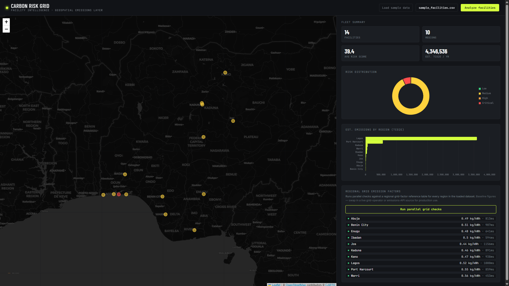

# Carbon Risk Grid — Facility Intelligence Dashboard

A Flask + vanilla JS dashboard that turns a CSV of facility addresses into
a live carbon risk map — with Chart.js metrics and a sidebar console that
runs parallel checks against regional grid emission factors.

##[Live demo →](https://carbon-risk.onrender.com/)



## Features

- 🗺️ **Interactive risk map** — Leaflet map with facilities plotted and
  color-coded by carbon risk category (low / medium / high / critical)
- 📊 **Live fleet metrics** — risk distribution and emissions-by-region
  charts (Chart.js), computed the moment a CSV is uploaded
- ⚡ **Parallel grid-factor checks** — a sidebar console that fires
  concurrent lookups against regional grid emission factors and streams
  results back in real time, one row per region
- 🧮 **Transparent risk scoring** — no black-box model; every score
  traces back to three visible, weighted inputs
- 📁 **CSV-in, dashboard-out** — no database, no setup beyond `pip install`

## Run it locally

```bash
pip install -r requirements.txt
python app.py
```

Open **http://localhost:5000**. Click **"Load sample data"** to see it
working immediately, or upload your own CSV.

## Deploy it

- **Render / Railway / Fly.io** — push to GitHub, connect the repo, and
  use the included `Procfile` (`gunicorn app:app --bind 0.0.0.0:$PORT`).
  No code changes needed.
- **Vercel** — push to GitHub and import the repo; the included
  `vercel.json` routes all requests to the Flask app as a serverless
  function.

## CSV format

Required columns: `facility_name, latitude, longitude, region`
Optional columns: `address, sector, capacity_mw, annual_emissions_tco2e`

If `annual_emissions_tco2e` is omitted, emissions are estimated from
`capacity_mw` using an assumed capacity factor and the region's grid
emission factor. Rows with invalid coordinates or a missing name are
skipped and reported back in the response, not silently dropped.

A ready-to-use example lives at `sample_data/sample_facilities.csv`.

## How risk is scored

`risk_model.py` computes a 0–100 score per facility from three
transparent, weighted components:

| Component | Weight | What it captures |
|---|---|---|
| Regional grid emission factor | 40% | How carbon-intensive the local grid is |
| Normalized annual emissions | 45% | The facility's estimated or reported output |
| Sector multiplier | 15% | Baseline risk differences across sectors |

The score is then bucketed into low / medium / high / critical. It's a
heuristic, not a trained model, by design: every score is traceable back
to its inputs, which matters when the output drives publication-facing
content.

## About the grid emission factor data

`emission_factors.py` ships with an **illustrative baseline** reference
table (kgCO2e/kWh), weighted toward Nigeria's gas-thermal grid with rough
per-region variance. It is not a live, verified feed. Before using this
for anything client-facing, swap `_lookup_one()` for a real source —
e.g. Transmission Company of Nigeria / NERC data, an IGES/IPCC grid
factor database, or a commercial API like Climatiq or Electricity Maps.
The UI intentionally labels these as "baseline" for the same reason.

## Parallel grid checks

The sidebar's "Run parallel grid checks" button fires one request per
region concurrently from the browser; the backend also runs its own
lookups through a `ThreadPoolExecutor` so a single multi-region request
resolves in parallel too. Each row in the console updates independently
as its check completes, with latency shown per region.

## Project layout

```
app.py                     Flask routes: /, /api/upload, /api/grid-check, /api/sample-csv
risk_model.py               Facility risk scoring
emission_factors.py          Grid factor reference table + parallel lookup
templates/index.html         Dashboard markup (Tailwind via CDN)
static/js/app.js              Map (Leaflet), charts (Chart.js), upload + check console logic
static/css/style.css          Telemetry-console animation, marker/popup theming
sample_data/                   Example CSV
docs/screenshot.png             README screenshot
Procfile                        Render/Railway/Heroku-style process definition
vercel.json                     Vercel serverless deployment config
```

## Notes for production

- Tailwind is loaded via the CDN Play build for zero-config prototyping;
  swap in a compiled Tailwind build before shipping.
- No authentication or rate limiting is included — add both before
  exposing this beyond a local/internal demo.
- `MAX_CONTENT_LENGTH` caps uploads at 5MB; adjust as needed.

## Tech stack

Flask · vanilla JavaScript · Leaflet · Chart.js · Tailwind CSS
